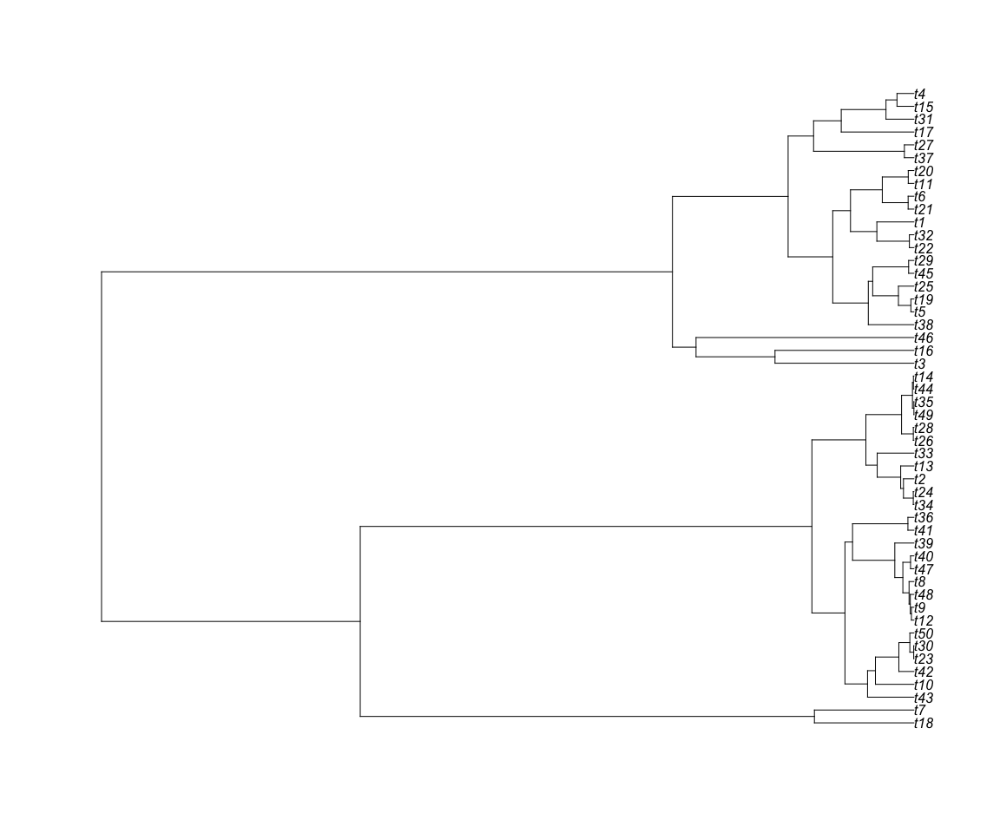
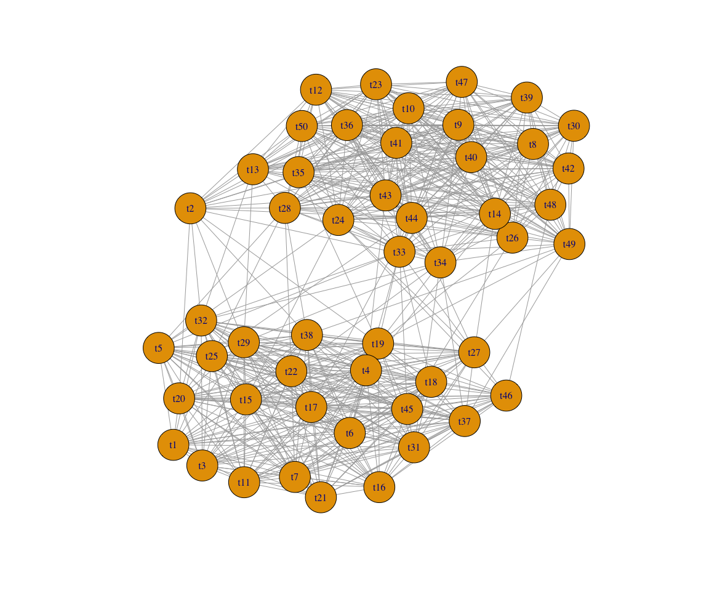

PhyloBCG
================

PhyloBCG implementation with simulated quantitative microbiome data.

Reference: Hee Cheol Chung, Irina Gaynanova and Yang Ni.
[Phylogenetically informed Bayesian truncated copula graphical models
for microbial association
networks](https://arxiv.org/pdf/2105.05082.pdf). *arXiv*

# Simple example

### Load packages and source functions

``` r
sourcePath <- "./functions/"
dataPath <- "./data/"

#Load QMP data
load(paste(dataPath,"QMPtree_for_simulation.RData",sep="") )

# Load packages and source functions
files.sources <-  list.files(path=sourcePath)
files.sources <- setdiff( files.sources, "TreeDataGeneration.R" )
extension <- substring(files.sources,nchar(files.sources)-1,nchar(files.sources))
lets.source <- paste(sourcePath, files.sources[extension==".R"], sep="")
mapply(source, lets.source) 
```

### Generate tree data

``` r
n <- dim(QMP)[1]  # Sample size
p <- dim(QMP)[2]  # Dimension
tree.scale <- 3
set.seed( 25990, kind = "Mersenne-Twister" ,sample.kind = "Rejection" )
source(paste(sourcePath,"TreeDataGeneration.R",sep=""))

H_t     <- cov2cor(H[1:p,1:p]) # Tree correlation matrix of the terminal nodes
H_tinv  <- solve(H_t) # Tree precision  matrix of the terminal nodes

# Generate synthetic microbiome data with the correlation matrix "SigmaTrue"
synthDat <- synthData_from_ecdf_and_z(QMP, mar = 2, SigmaTrue , n=n, seed = NULL, verbose = FALSE)
x <- synthDat$dat
z <- synthDat$z


plot(mytree$mytree)
```

<!-- -->

``` r
plot(graph_from_adjacency_matrix( Wtrue, mode="undirected"),layout=layout_with_kk)
```

<!-- -->

### Set hyperparameters

``` r
########################################################################
#####             Set hyperarameters                ####################
########################################################################
## Fix some hyperparameters
# Note that the parameterization used in the code is slightly different from those in Wang (2014).  )
h <-  2500      # (v0 in code) = (v0 in paper)^2
lambda <-  1    # Rate paramter of exponential prior for SSVS
IGsig2 <-  rep(1e-3,2) # Inv-gamma parameters for tree scale parameter (sigma2)
IGv0   <- rep(1e-3,2) # Inv-gamma parameters for the spike and slab (v0)
hyperparameters <- list(h=h, lambda=lambda, IGsig2=IGsig2, IGv0=IGv0)
K <- 2 # Latent space dimension
```

### Set initial values

``` r
# Get scaled empirical cdfs and zhat
ecdf.scale <- n/(n+1)
eFx  <- apply(x,2,ecdf)
eFx  <- lapply(eFx, function(x){  function(y)  ecdf.scale *x(y) })
eFxx <- Map(function(f,x) do.call(f, list(x)), eFx, alply(x,2)  )
zhat <- matrix( unlist( lapply(eFxx,function(pr) qnorm( pr ) ) ), n, p)

########################################################################
########   Initial values for gibbs sampling ###########################
########################################################################

R_mc     <- cor(zhat)               # Initial correlation matrix
zhat_mc  <- zhat                    # Initial truncated data. Observed data will be fixed
delta_mc <- qnorm( colSums( x==0 )/n ) # Initial threshold
v0_mc   <- 0.01                     # Initial spike variance
tau_mc  <- h*v0_mc*matrix(1,p,p)    # Matrix representation of spike and slab variances
pijk_mc <- matrix( 2 / (p - 1),p,p) # Initial edge inclusion probability
U_mc <- mvtnorm::rmvnorm(K, rep(0,p), H_t )  # Initial latent positions
sig2_mc <- 1                        # Initial tree scale parameter
```

### Run treeGibbs

``` r
burnin <- 50  # Number of burnin-iteration
nmc    <- 50  # Number of MCMC-sample that will be kept

gibbsSample <- treeGibbs(x, x.new=NULL, delta_mc, zhat_mc, R_mc, v0_mc, tau_mc, pijk_mc, U_mc, sig2_mc,
                         hyperparameters, burnin, nmc, verbose=FALSE, thin=NULL)
```
